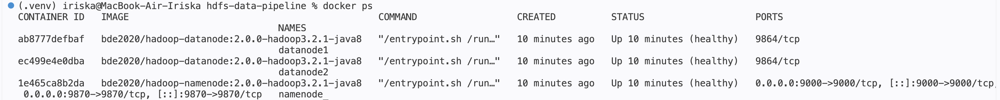
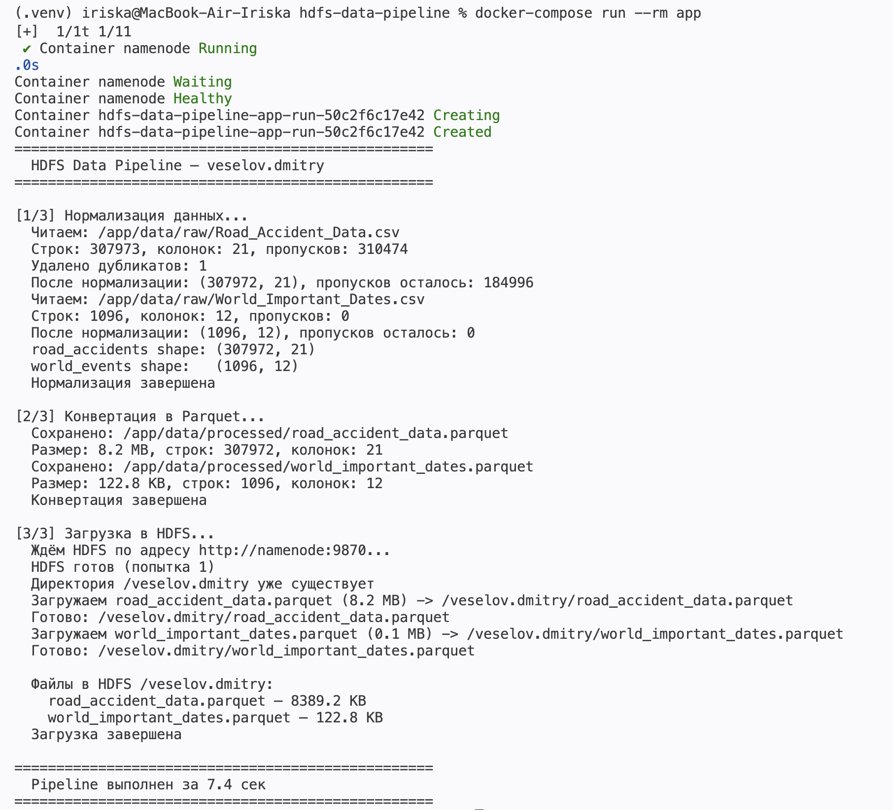
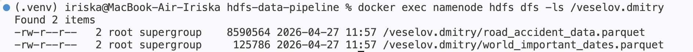
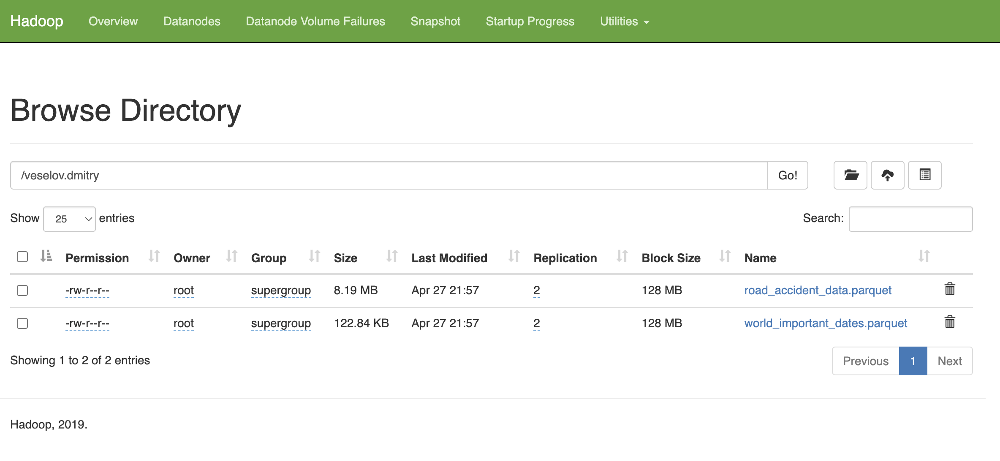
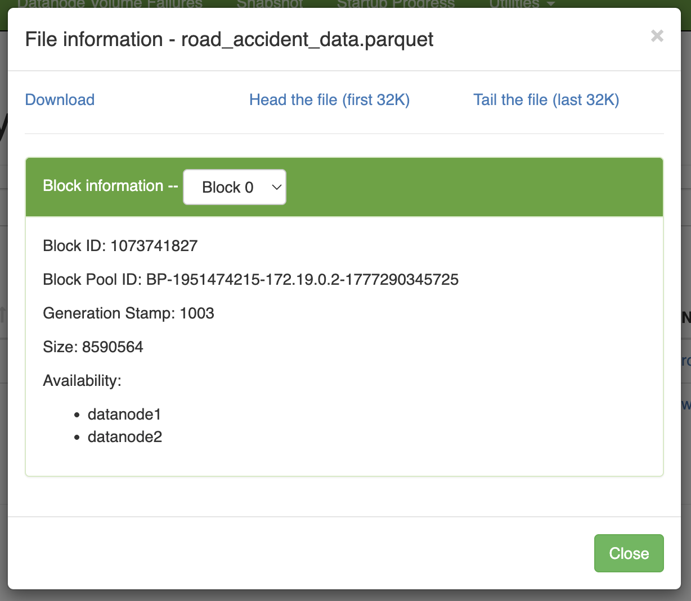

# hdfs-data-pipeline

End-to-end data engineering pipeline that ingests raw CSV data, normalizes it, converts to Parquet, and loads into a distributed Hadoop HDFS cluster — all containerized with Docker.

```
Raw CSV  →  Normalization  →  Parquet (Snappy)  →  HDFS (replication × 2)
```

---

## Datasets

| Dataset | File | Rows | Columns |
|---|---|---|---|
| Car Accident Dataset (UK) | `Road_Accident_Data.csv` | 307 973 | 21 |
| World Important Events | `World_Important_Dates.csv` | 1 096 | 12 |

---

## Project Structure

```
hdfs-data-pipeline/
├── docker-compose.yml          # HDFS cluster + app container
├── Dockerfile
├── hadoop.env
├── requirements.txt
├── data/
│   ├── raw/                    # source CSV files
│   └── processed/              # normalized Parquet files
├── notebooks/
│   └── data_preview.ipynb
└── src/
    ├── main.py                 # pipeline entry point
    ├── normalize.py            # stage 1 — data cleaning
    ├── convert_to_parquet.py   # stage 2 — Parquet conversion
    └── upload_to_hdfs.py       # stage 3 — HDFS upload
```

---

## Infrastructure

The cluster runs in Docker Compose with 4 services:

| Container | Image | Role |
|---|---|---|
| `namenode` | `bde2020/hadoop-namenode:3.2.1` | Stores filesystem metadata and block locations |
| `datanode1` | `bde2020/hadoop-datanode:3.2.1` | Stores actual data blocks |
| `datanode2` | `bde2020/hadoop-datanode:3.2.1` | Stores replicated data blocks |
| `app` | custom Python 3.11 | Runs the pipeline |

**Replication factor = 2** — every data block is physically stored on both DataNodes. If one node fails, data remains available on the other.

---

## Quick Start

### 1. Start the HDFS cluster

```bash
docker-compose up -d namenode datanode1 datanode2
```

Wait ~30 seconds for the NameNode to initialize, then verify:

```bash
docker ps
```

All three containers should show `(healthy)`:



---

### 2. Run the pipeline

```bash
docker-compose run --rm app
```

The app container starts automatically after the NameNode healthcheck passes, then executes all three stages:



**What happens under the hood:**

**Stage 1 — Normalization** (`normalize.py`)
- Column names → `snake_case` (e.g. `Local_Authority_(District)` → `local_authority_district`)
- Strip whitespace, lowercase text fields
- Fill missing text values with `"unknown"`, leave numeric columns untouched
- Remove duplicates (1 found and removed in accidents dataset)
- Parse `accident_date` → `datetime64`

**Stage 2 — Parquet conversion** (`convert_to_parquet.py`)
- Save normalized DataFrames as Parquet with Snappy compression
- `road_accident_data.parquet` — 8.2 MB (down from 66 MB CSV)
- `world_important_dates.parquet` — 122.8 KB

**Stage 3 — HDFS upload** (`upload_to_hdfs.py`)
- Wait for HDFS WebHDFS API to be ready
- Create directory `/veselov.dmitry` if not exists
- Upload both Parquet files with `overwrite=True`
- Print file listing with sizes after upload

Total pipeline time: **~7–12 seconds**

---

## Verify Results

### CLI

```bash
docker exec namenode hdfs dfs -ls /veselov.dmitry
```



```
-rw-r--r--   2 root supergroup   8590564  /veselov.dmitry/road_accident_data.parquet
-rw-r--r--   2 root supergroup    125786  /veselov.dmitry/world_important_dates.parquet
```

The `2` in the third column is the replication factor.

### Web UI

Open [http://localhost:9870](http://localhost:9870), then go to **Utilities → Browse the file system → `/veselov.dmitry`**:



Both files are visible with **Replication = 2** and **Block Size = 128 MB**.

### Replication confirmed

Clicking on a file shows block-level details — the block is stored on both `datanode1` and `datanode2`:



This confirms real distributed storage: the file is split into HDFS blocks and each block is replicated across two DataNodes.

---

## Stop the cluster

```bash
docker-compose down
```

To also remove HDFS volumes (data will be lost):

```bash
docker-compose down -v
```

---

## Tech Stack

- **Python 3.11** — pandas, pyarrow, hdfs, requests
- **Apache Hadoop 3.2.1** — HDFS distributed storage
- **Docker / Docker Compose** — containerized infrastructure
- **Parquet + Snappy** — columnar storage format

---

## Author

Dmitry Veselov
